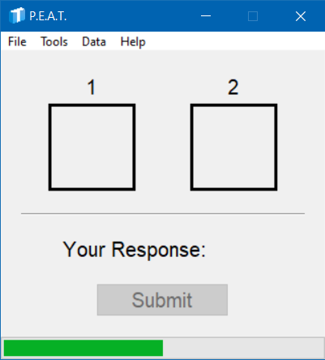
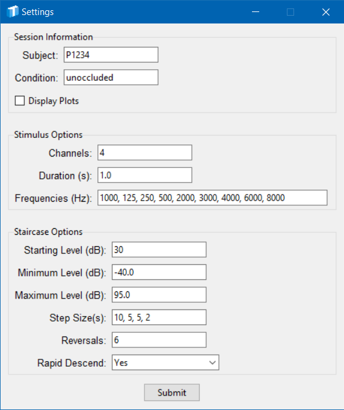
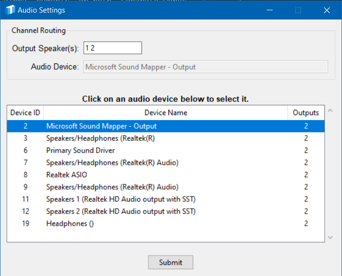
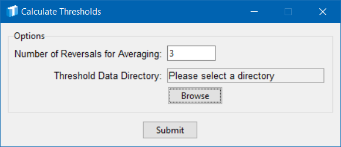

<div style="text-align: center;">
    
</div>

<div style="text-align: center;">
    <h1>P.E.A.T.
    <br>
    P.sychophysical E.stimation<br>
    of
    <br>
    A.uditory T.hresholds</h1>

    Written by: <b>Travis M. Moore</b>
    <br>
    Latest version: <b>Version 2.0.2</b><br>
    Originally created: <b>January 04, 2024</b><br>
    Last edited: <b>May 14, 2024</b><br><br>
</div>

---

# Description
P.E.A.T. is a subject-facing tool for estimating auditory thresholds using a two-interval, adaptive forced choice (2IAFC) task. Raw data are exported to CSV, and contain every step of the staircase. P.E.A.T. can also calculate thresholds from raw data, with batching capabilities.
<br>
<br>

---

# Getting Started

## Dependencies

- Windows 10 or greater (not compatible with Mac OS)

## Installing

- This is a compiled app; the executable file is stored on Starfile at: \\starfile\Public\Temp\MooreT\Custom Software

- Simply copy the executable file and paste to a location on the local machine. 

- **DO NOT RUN FROM THE STARFILE SERVER.** This ties up the program for others, and will result in erratic app behavior. 

## First Use
- **DO NOT RUN FROM THE STARFILE SERVER.** This ties up the program for others, and will result in erratic app behavior. That's right, this statement is identical to the one above - it's that important!

- Double-click to start the application for the first time.
<br>
<br>

---

# Verbiage for Instructing Participants
NOTE: Written in lay language, so wording is not scientifically accurate (e.g., use of the word "pitch" instead of "frequency").

The point of this task is to estimate the softest sounds you can hear, using a range of low-pitch to high-pitch sounds. The task consists of listening to two brief intervals of time, one after the other. You will know which interval is playing by watching the boxes on the screen in front of you. The empty box below the number 1 will turn blue while interval 1 plays (and go back to clear when interval 1 is over). Immediately following interval 1, interval 2 will play and its box will turn blue. When interval 2 is done playing, the box will return to clear. 

There are two things that make the task a little tricky: 1. only one interval will contain a sound (the other interval will only contain silence), and 2. the sounds will get softer and softer over time. Your job is to choose the interval that contained the sound. Please make your selection by pressing either the "1" key (for interval 1) or the "2" key (for interval 2). It seems easy, but can get difficult near your threshold (the softest sound you can hear). If you do not hear a sound in either interval, simply guess. 

You will see a message appear after each threshold is completed to allow you time for breaks. You can also monitor your progress through the entire session by looking at the progress bar at the bottom of the screen; it will update based on the number of sounds left to test. 
<br>
<br>

---

# Valid Test Frequencies
Because estimation of audiometric thresholds relies on RETSPLs (reference equivalent threshold sound pressure levels), only a subset of frequencies can be reliably tested with PEAT. Valid frequencies are mostly 1/3 octave values, with a few audiometric additions (e.g., 6000 Hz). 

Full list of test frequencies allowable with PEAT:<br>
```
20, 25, 31.5, 40, 50, 63, 80, 100, 125, 160,
200, 250, 315, 400, 500, 630, 750, 800, 1000, 1250,
1500, 1600, 2000, 2500, 3000, 4000, 6000, 6300, 8000, 9000,
10000, 1200, 14000, 16000
```
<br>
<br>

---

# Main Screen
The image below shows the main screen of the P.E.A.T. application.  



## Intervals
The top half of the screen (i.e., above the horizontal grey line) is used to display intervals during the task. When an interval is active, the box will turn blue. Every trial will follow the pattern:

1. The box for interval one turns blue for a short time
2. The box for interval one is cleared
3. The box for interval two turns blue for a short time
4. The box for interval two is cleared

Only one interval will contain the stimulus - the other interval will contain silence. The goal of the task is to select which interval contained the stimulus by indicating 1 or 2 using a keypad.

## Response Collection/Progress
The bottom half of the screen (i.e., below the horizontal grey line) is used to collect participant responses and display progress during the task. 

<b>Your Response:</b> Displays the currently selected interval (i.e., 1 or 2). Updates in real time to avoid having to look at the keypad.

<b>Submit:</b> After choosing an interval, the submit button saves the response. 

<b>Progress Bar:</b> The progress bar will increase after the threshold for a given frequency has been established; its progress is based on the number of test frequencies. 
<br>
<br>

---

# File Menu

## File>Settings
The image below shows the options available by navigating to ```File>Settings```.

NOTE: The values entered in the image below are good default values for testing SoundGear devices.



### <u>Session Information</u>
<b>Subject:</b> A unique subject identifier. Can be alpha, numeric, or both.

<b>Condition:</b> A unique condition name. Can be alpha, numeric, or both. Separate words with underscores (e.g., occluded_design1).

<b>Display Plots:</b> Display staircase plots after each threshold. Useful for troubleshooting and training.

### <u>Stimulus Options</u>
<b>Channels:</b> The number of channels for audio playback. Each separate channel will contain a mono copy of the stimulus with a random starting phase, for use in the sound field. 

NOTE: You must update the channel routing accordingly. For example, a four-channel stimulus will require specifying four playback channels in ```Tools>Audio Settings```.

<b>Duration (s):</b> Duration of the stimulus (per interval) in seconds.

<b>Frequencies (Hz):</b> Frequencies to test in a given session. Separate multiple frequencies with a comma and space (e.g., ```500, 1000, 2000```). Frequencies will be tested in the order provided. All frequencies will be tested in a single session, without the need for investigator intervention. 

### <u>Staircase Options</u>
<b>Starting Level (dB):</b> The first level presented when starting a new threshold search (i.e., the staircase will start at this level for each frequency tested).

<b>Minimum Level (dB):</b> The minimum permissible output level in dB. The application will not present levels below this.

<b>Maximum Level (dB):</b> The maximum permissible output level in dB. The application will not present levels above this.

<b>Step Size(s):</b> The step size(s) used by the staircase for bracketing a threshold. The last step size will be repeated until all reversals have been collected. Separate multiple values with a comma and space (e.g., ```10, 5, 5, 2```). 

<b>Reversals:</b> The number of reversals to obtain before stopping the procedure. The number of reversals must be at least equal to the number of step sizes. Providing a number of reversals greater than the number of steps results in repeating the final step size until all reversals are completed. 

NOTE: The number of reversals to collect is different than the number of reversals for averaging (i.e., to determine a threshold). 

<b>Rapid Descend:</b> Initial decrease with 1-down rule to reach near-threshold levels faster.

## File>Start Task
In order to prevent participants from beginning the task unexpectedly, the application must be started from the ```File``` menu.
<br>
<br>

---

# Tools Menu

## Tools>Audio Settings
The ```Audio Settings``` window (below) allows you to select an audio device and assign speakers for playback. 



<b>Channel/Speaker Assignment.</b> To assign a channel/speaker for playback, enter the speaker/channel number in the ```Output Speaker(s)``` entry box in the ```Channel Routing``` options group. Note that you must provide a speaker for each channel in the audio file. For example, if your stimulus has eight channels, you must provide a list of eight speakers. Separate numbers with spaces when providing a list of speakers. For example: ```1 2 3 4 5 6 7 8```.

<b>Device Selection.</b> The ```Audio Settings``` window displays available audio devices in a table (lower part of image). Simply click to choose the desired device. Your selection will be highlighted in blue and displayed in the ```Audio Device``` section of the ```Channel Routing``` group. 

## Tools>Calibration
The Calibration window (below) provides a simple way to calibrate your stimuli using a sound level meter (SLM). 

NOTE: Calibration files are imported without any scaling applied. In essence, "dB FS" is simply however the system is set, and the original level of the recording. 


<b>Calibration Stimulus.</b> You can choose to use the built-in white noise, or provide a custom file for the calibration signal (top group in image). If a multi-channel custom calibration file is provided, ensure the correct number of channels have been assigned in ```Tools>Audio Settings```. 

<b>Playback Controls.</b> Use the ```Level (dB)``` entry box to adjust the digital playback level in dB (middle group in image). Adjust the level until the SLM reads above the noise floor of the room. The ```Play``` and ```Stop``` buttons allow you to start and stop the audio playback.

<b>Measured Level.</b> Use an SLM to measure the level of the calibration signal and enter the value into the ```SLM Reading (dB)``` entry box (bottom group in image). Click submit, and the application will calculate an offset so that you can specify presentation levels in dB (whichever type of dB you set the SLM to when measuring). 

NOTE: For multi-channel files, the same SLM offset is applied to each channel individually. <b>Currently there is not support for multiple SLM offsets.</b>

NOTE: The ```Submit``` button is disabled until you click the ```Play``` button.
<br>
<br>

---

# Data Menu

## Data>Calculate Thresholds
The data window (below) provides an easy-to-use interface for calculating estimated thresholds from raw data files from this application. Batching capabilities are built in, and only require that all raw data files are located in the same directory.



## Options
<b>Number of Reversals for Averaging:</b> The number of reversals to average over (starting at the last trial and moving backwards) for calculating a threshold. A minimum of three reversals is suggested. DO NOT INCLUDE THE INITIAL REVERSAL IN THE AVERAGE. <b>The user is responsible for entering a valid number based on the parameters used for estimating thresholds. </b>

NOTE: The maximum permissible value depends on the number of reversals that were originally obtained during the task (see File>Settings). 

<b>Threshold Data Directory:</b> Click the ```Browse``` button to open a file explorer. Simply navigate to the directory where the raw data are stored. 

<b>Submit:</b> Upon clicking the ```Submit``` button, thresholds will be calculated based on the factors of subject, condition, and test frequency. If finer granularity is desired, a custom analysis script must be used. The thresholds will be written to a CSV file named "thresholds.csv" that will appear in the directory from which the application itself is being run. 
<br>
<br>

---

# Compiling from Source
```
pyinstaller --noconfirm --onefile --windowed --icon "C:/Users/MooTra/Code/Python/audiometer/app_assets/images/logo_icons/logo_full.ico" --add-data "C:/Users/MooTra/Code/Python/audiometer/app_assets;app_assets/"  "C:/Users/MooTra/Code/Python/audiometer/controller.py"
```
<br>
<br>

---

# Contact
Please use the contact information below to submit bug reports, feature requests and any other feedback.

- Travis M. Moore: travis_moore@starkey.com
